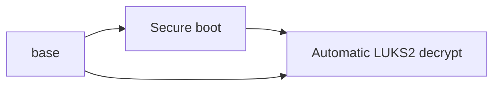

# My Arch Linux Installation

This repository serves to remember my steps to install Arch Linux as I wanted, that is:

- a minimal installation with Arch with LVM + LUKS2: [base.md](./base.md)
- Secure boot: [secure_boot.md](./secure_boot.md)
- Automatic full disk decrypt: [automatic_LUKS2_decrypt.md](./automatic_LUKS2_decrypt.md)

